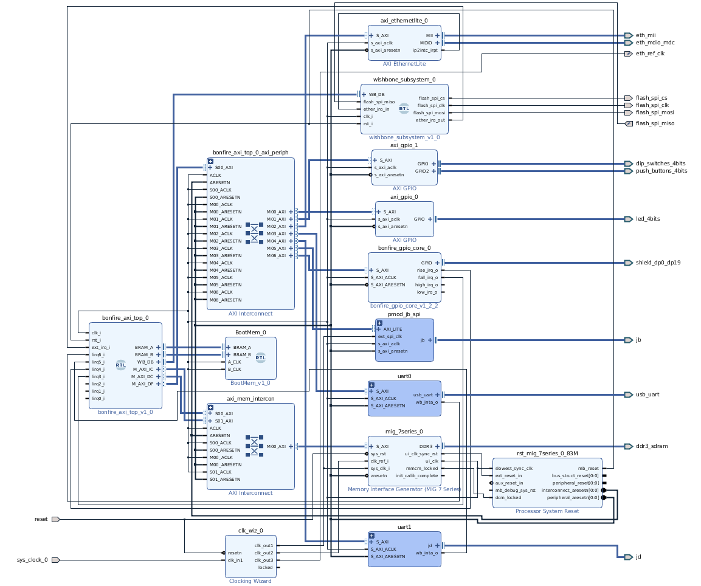

# bonfire_arty_a7_full
Bonfire implementation for Digilent Arty board with Network and DRAM



The IP Integrator Block Design is configured as follows:

## Hardware

#### [Bonfire AXI Core](https://github.com/bonfireprocessor/bonfire_axi)
The Bonfire AXI Core contains the Bonfire Core together with Instruction and Data Cache. It is designed to be used with Xilinx IP Integrator and is "plug-in" compatible with the Microblaze Processor from Xilinx.

In the Arty Image it is configured as follows:

* Bonfire RISC-V CPU Version 1.20 implementing RV32IM
* 32KB Instruction Cache
* 32KB Data Cache

#### Memory
* 256MB of DDR3 Memory on the Arty Board
* 32KB of Block RAM for the Boot Monitor
* SPI Interface to the On Board Flash Memory

#### Arty Onboard Peripherals:
* USB-UART for Serial I/O
* Xilinx GPIO Core for Switches and LEDs of the ARTY Board
* Xilinx AXI Etherlite Core connected to the 10/100MB Ethernet PHY

#### External Peripherals:
* UART on PMOD Port JD
* Xilinx AXI QSPI Core on PMOD JB, e.g. to use an SDCard PMod

#### GPIO
* [Bonfire-GPIO Peripheral](https://github.com/bonfireprocessor/bonfire-gpio) connected Arduino Digital I/O Headers

## Software
  * Bonfire Boot Monitor
    * Cache and Memory Test
    * Hexdump Utility
    * XModem Download of Binary Images
    * Flash read/write to save a Binary Image on the Arty Onboard Flash and "boot" from the image stored in flash

## How to build
The Design is intended to be build with fusesoc.
So you must first install fusesoc from https://github.com/olofk/fusesoc.git

The current build script is build with Vivado 2018.1, 2018.2 or 2019.2 so you should one of these versions , in other cases you need to adapt the build script.


### Setup and Build

Clone the root project https://github.com/bonfireprocessor/bonfire.git

`git clone https://github.com/bonfireprocessor/bonfire.git`

Change to the project directory

`cd bonfire`

Check the fusesoc.conf file and enter the correct path for build_root

From the project directory execute:
````
git submodule update --init --recursive
fusesoc --config fusesoc.conf build --no-export --setup bonfire-arty-a7
cd <your build root path>/bonfire-arty-a7_0/bld-vivado
source <Your Xilinx install Dir>/Vivado/< your vivado version:YYYY.X>/settings64.sh
make build-gui
````
The last step will create the project and the IP Integrator design and will start the Vivado GUI. In Viavdo GUI you can use the usual implemenatition workflow to build the Bitstream. 
If you prefer background operation use 
````
make all
`````
